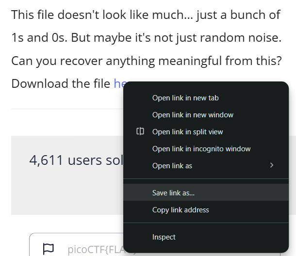
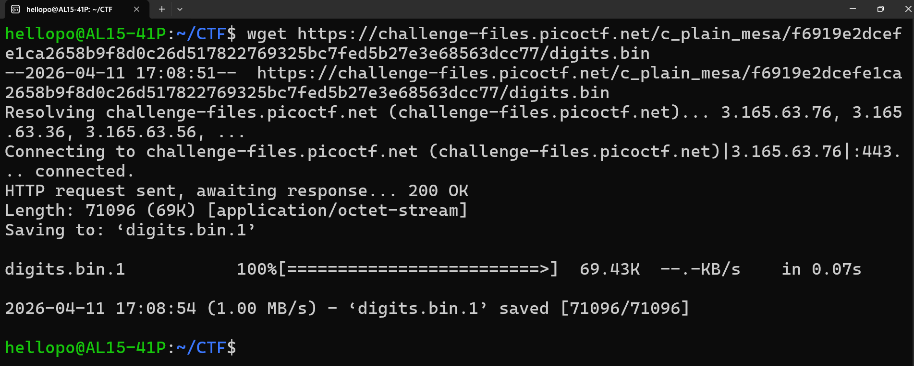
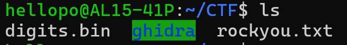
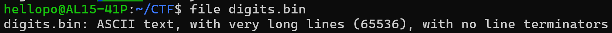
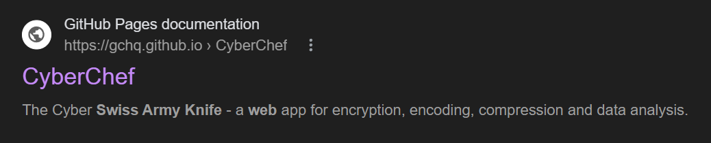
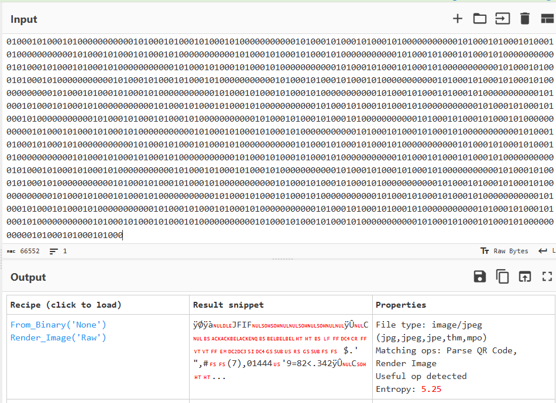
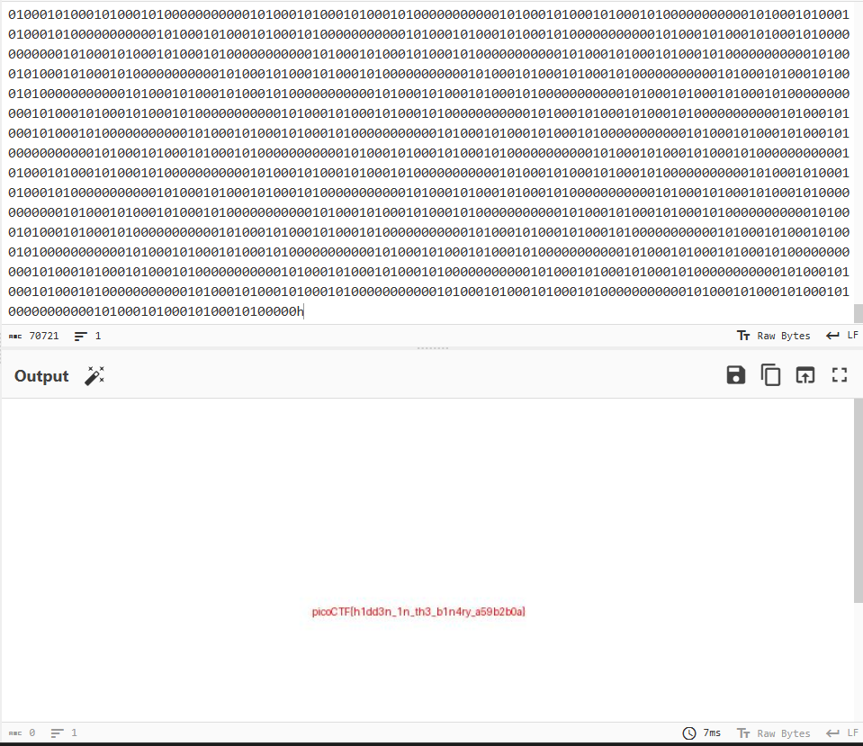

This is the first challenge I'm solving for 2026.

CTF Name: picoCTF

Challenge Name: Binary Digits

Category: Forensics

Difficulty: Easy

Challenge Description: 
"This file doesn't look like much... just a bunch of 1s and 0s. But maybe it's not just random noise. Can you recover anything meaningful from this?
Download the file here."

SOLVING PROCESS:

The description tells us that the file consists of a bunch of 1s and 0s, so it must be a .bin file.

A .bin file (binary file) is a non-text file format containing machine-readable data, commonly used for CD/DVD disk images, firmware updates, or application data. It stores raw binary code, often requiring specialized software like ISO Buster, UltraISO, or PowerISO to mount or extract, especially when accompanied by a .cue metadata file. 

It hints that the file contains a bunch of noise, which tells me that we're gonna have to look at a lot of code, and find out which lines have the flag.

The first step is to hop on a Linux environment. I'm using Ubuntu because it's easy to use for a beginner like me. 

I open my Ubuntu software. (22.04.5 LTS)

I right click the file link, and hit "Copy link address"

Now, the link is in my clipboard and I get use the wget command to download it into my Linux environment.

After successfully downloading, digits.bin can be seen in my current directory after using the ls command.

In a CTF, a .bin file is rarely just raw binary data. It is often a disguise for other file types like an executable or a disk partition image. 

To unmask its true identity, I used the file command to inspect its Magic Bytes (file signatures), rather than relying on the extension.

We find out that its ASCII text, and most importantly, it is 65536 lines. 

That is a very important detail, because that number is exactly 2^16 and is the perfect square of 256. It's also exactly 64 KiB.

This hints that the binary is an image map that is shaped as a square. 

We need to wrap the text every 256 characters and view what the image is.

We can use CyberChef for this (the Cyber Swiss Army Knife). Here's the link:

https://gchq.github.io/CyberChef/

It has a great tool called Magic operation. Here's what it does:

The Magic operation attempts to detect various properties of the input data and suggests which operations could help to make more sense of it.

It's basically an automatic decrypter for whatever possible likely encryptions something has. 
It's great for a time-bound CTF environment because it saves a lot of time guessing what it is.
But it's important to know the fundamental reasons or logic as to how or why you got the answer that you did.

Anyway, using the Magic operation tells us that it's likely an image file.

So we will click the first suggestion to perform that decryption.

The flag is: 

picoCTF{h1dd3n_1n_th3_b1n4ry_a59b2b0a}
